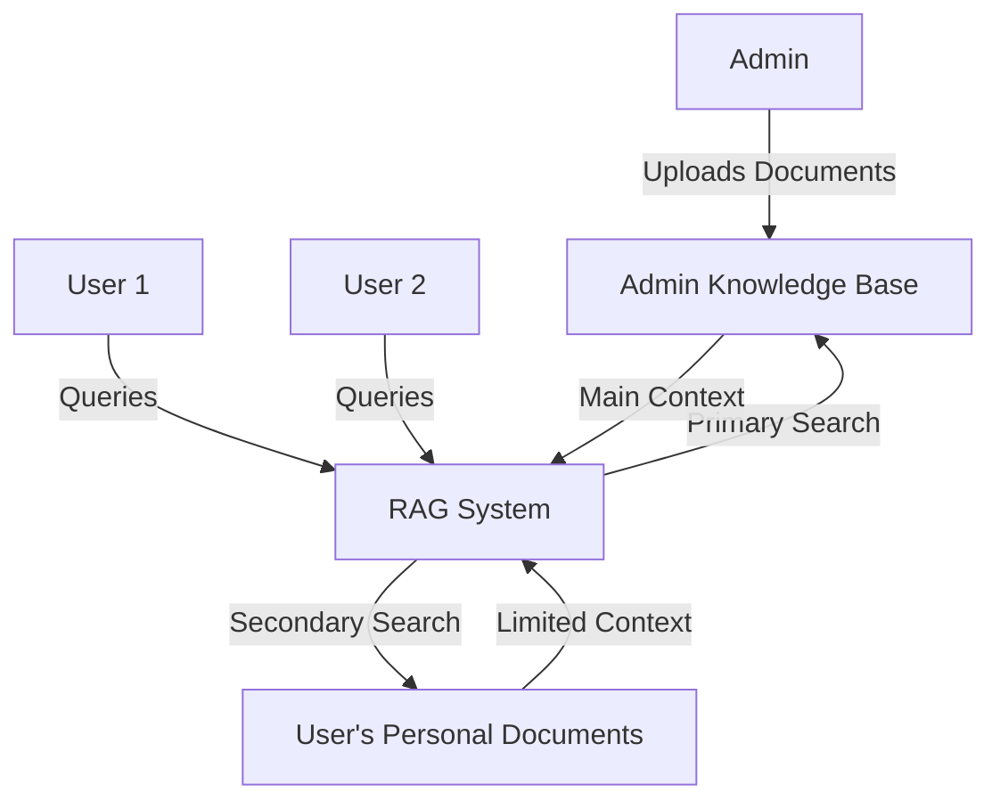

# Centralized RAG Knowledge Base Plan

## Overview

This document outlines the plan to centralize the RAG (Retrieval Augmented Generation) functionality in Azure Tenant AI Chat to prioritize the admin's knowledge base over individual user documents. This approach will ensure consistent, organization-wide knowledge is available to all users while still allowing for personalized document context when needed.

## Current Architecture

The current implementation creates isolated database instances per user, with each user having their own document collection for RAG:

1. Documents are uploaded by individual users to their chat threads
2. Embeddings are stored in the user's dedicated database 
3. RAG searches are scoped to the current user's documents and chat thread
4. Search results pull exclusively from the user's own document collection

This isolation provides privacy but limits knowledge sharing across the organization.

## Proposed Changes

### 1. Centralized Admin Knowledge Base

Create a distinguished admin knowledge base that will be the primary source of information for all users:



### 2. Database Schema Modifications

Modify the database schema to support centralized knowledge:

```sql
ALTER TABLE documents ADD COLUMN is_admin_kb BOOLEAN NOT NULL DEFAULT FALSE;
CREATE INDEX idx_admin_kb ON documents (is_admin_kb) WHERE is_admin_kb = TRUE;
```

### 3. Modified Similarity Search Implementation

Update the `SimilaritySearch` function in `neondb-ai-search.ts` to prioritize admin documents:

```typescript
export const SimilaritySearch = async (
  searchText: string,
  k: number,
  userId: string,
  chatThreadId: string,
  adminRatio: number = 0.7 // 70% admin documents by default
): Promise<ServerActionResponse<Array<DocumentSearchResponse>>> => {
  try {
    // Get embeddings as before
    const openai = OpenAIEmbeddingInstance();
    const embeddings = await openai.embeddings.create({
      input: searchText,
      model: "",
    });
    const embeddingVector = embeddings.data[0].embedding;

    // Calculate number of admin and user documents to fetch
    const adminK = Math.floor(k * adminRatio);
    const userK = k - adminK;

    const sql = await NeonDBInstance();
    
    // Query admin documents
    const adminQueryResults = await sql(`
      SELECT id, 
             page_content AS "pageContent", 
             user_id, 
             chat_thread_id AS "chatThreadId", 
             metadata, 
             embedding,
             (embedding <-> $1::vector) AS distance
      FROM documents
      WHERE is_admin_kb = TRUE
      ORDER BY distance ASC
      LIMIT $2;
    `, [`[${embeddingVector.join(", ")}]`, adminK]);

    // Query user's documents
    const userQueryResults = await sql(`
      SELECT id, 
             page_content AS "pageContent", 
             user_id, 
             chat_thread_id AS "chatThreadId", 
             metadata, 
             embedding,
             (embedding <-> $1::vector) AS distance
      FROM documents
      WHERE user_id = $2 AND chat_thread_id = $3 AND is_admin_kb = FALSE
      ORDER BY distance ASC
      LIMIT $4;
    `, [`[${embeddingVector.join(", ")}]`, userId, chatThreadId, userK]);

    // Combine and sort results
    const combinedResults = [...adminQueryResults, ...userQueryResults]
      .sort((a, b) => a.distance - b.distance);
    
    return {
      status: "OK",
      response: combinedResults.map((row) => ({
        score: 1 / (1 + row.distance),
        document: {
          id: row.id,
          pageContent: row.pageContent,
          userId: row.user_id,
          chatThreadId: row.chatThreadId,
          metadata: row.metadata,
          embedding: row.embedding,
        },
      })),
    };
  } catch (e) {
    // Error handling
  }
};
```

### 4. Admin Document Management UI

Create a dedicated interface for admins to manage the centralized knowledge base:

1. Add a new section to the admin dashboard for document management
2. Implement bulk upload, tagging, and categorization features
3. Provide analytics on document usage and relevance
4. Allow admins to manually curate the knowledge base

### 5. User Interface Updates

Update the chat interface to indicate when responses are sourced from the admin knowledge base:

1. Add visual indicators for admin knowledge vs. personal documents
2. Create toggles to control the ratio of admin/personal knowledge
3. Provide feedback mechanisms for users to report inaccurate information

### 6. Document Indexing Updates

Modify the `IndexDocuments` function to support admin documents:

```typescript
export const IndexDocuments = async (
  fileName: string,
  docs: string[],
  chatThreadId: string,
  isAdminKb: boolean = false
): Promise<Array<ServerActionResponse<boolean>>> => {
  try {
    const hashedId = await userHashedId();
    
    if (!hashedId) {
      return [{
        status: "UNAUTHORIZED",
        errors: [{
          message: "User identification required",
        }],
      }];
    }
    
    // Check if user is admin when trying to add admin documents
    if (isAdminKb) {
      const user = await getCurrentUser();
      if (!user.isAdmin) {
        return [{
          status: "UNAUTHORIZED",
          errors: [{
            message: "Admin access required to update central knowledge base",
          }],
        }];
      }
    }
    
    // Continue with document indexing as before, but add the is_admin_kb field
    // ...

    // Update SQL insert statement
    await sql(
      `INSERT INTO documents (id, page_content, user_id, chat_thread_id, metadata, embedding, is_admin_kb)
       VALUES ($1, $2, $3, $4, $5, $6, $7);`,
      [
        doc.id,
        doc.pageContent,
        doc.userId,
        doc.chatThreadId,
        doc.metadata,
        `[${doc.embedding.join(', ')}]`,
        isAdminKb,
      ]
    );
    
    // ...
  }
};
```

### 7. Chat API Modifications

Update the `ChatApiRAG` function to make the admin knowledge ratio configurable:

```typescript
export const ChatApiRAG = async (props: {
  chatThread: ChatThreadModel;
  userMessage: string;
  history: ChatCompletionMessageParam[];
  signal: AbortSignal;
  adminKbRatio?: number; // New parameter
}): Promise<ChatCompletionStreamingRunner> => {
  const { chatThread, userMessage, history, signal, adminKbRatio = 0.7 } = props;
  
  // Use the admin ratio in the similarity search
  const documentResponse = await SimilaritySearch(
    userMessage,
    10,
    hashedId,
    chatThread.id,
    adminKbRatio
  );
  
  // Continue as before...
};
```

## Implementation Phases

### Phase 1: Database Schema and Core Search Updates
- Add `is_admin_kb` column to documents table
- Update `SimilaritySearch` function
- Update `IndexDocuments` function
- Create admin-only endpoints for knowledge base management

### Phase 2: Admin UI Development
- Develop Admin Knowledge Base dashboard
- Implement document categorization and tagging
- Create bulk upload functionality
- Add usage analytics

### Phase 3: User Experience Enhancements
- Update chat interface to show knowledge source
- Add admin/personal knowledge ratio controls
- Implement feedback mechanisms
- Update documentation and help information

### Phase 4: Testing and Optimization
- Performance testing with large admin knowledge bases
- Optimize search algorithms and ratios
- Conduct user acceptance testing
- Gather feedback and refine implementation

## Considerations

### Performance
- Monitor query performance with large admin knowledge bases
- Implement caching for frequently accessed admin documents
- Consider partitioning strategies for the admin knowledge base

### Security
- Ensure proper access controls for admin knowledge management
- Implement versioning and audit logs for admin knowledge changes
- Consider content filtering for sensitive information

### Flexibility
- Allow per-user or per-organization customization of admin/personal ratio
- Provide mechanisms to exclude specific admin knowledge for certain users
- Support knowledge base segmentation by department or function

## Conclusion

Centralizing the RAG knowledge base with an emphasis on admin-curated content will significantly improve consistency of information across users while maintaining the flexibility of personal document context. This approach balances organizational knowledge management with personalized assistance, making the Azure Tenant AI Chat more valuable for enterprise deployments. 